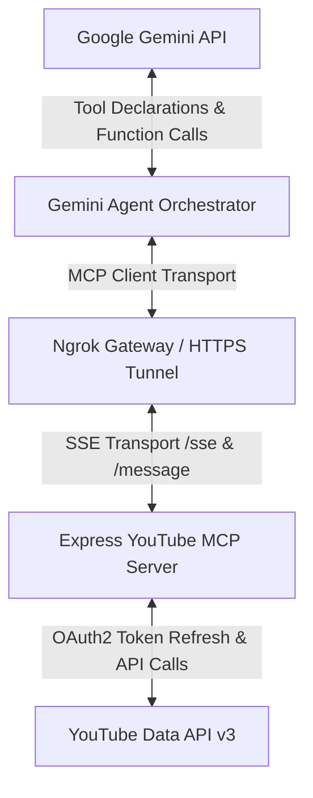

# 🚀 Google Gemini AI + YouTube MCP + Ngrok Gateway Engine

A zero-cost, persistent YouTube Studio Automation Engine powered by **Google Gemini 2.5 Flash**, a **YouTube Studio Model Context Protocol (MCP)** Server over Server-Sent Events (SSE) or Stdio, and an **Ngrok HTTPS Gateway**.

---

## 🌟 Key Features

- 🧠 **AI-Powered Channel Creator Assistant**: Uses Google Gemini (`gemini-2.5-flash` via `@google/genai`) to evaluate comment sentiment, craft engaging responses, and retrieve channel analytics.
- 📡 **Model Context Protocol (MCP) Server**: Exposes YouTube Studio capabilities (`get_channel_stats`, `fetch_unanswered_comments`, `post_comment_reply`) as standard MCP tools.
- 🌐 **Ngrok Gateway**: Programmatically establishes a secure public HTTPS tunnel to remote SSE/Webhook clients.
- 🔄 **OAuth2 Persistent Connectivity**: Automatically refreshes Google YouTube Data API access tokens seamlessly.
- ⏱️ **Rate-Limit Resilience**: Built-in exponential backoff retry logic handling HTTP 429 and rate-limiting gracefully.
- 🔌 **Flexible Transports**: Supports both **Embedded Express SSE Mode** out-of-the-box and **External GitHub MCP Servers** (via `stdio`).

---

## 📐 Architecture



---

## 🛠️ Step-by-Step Prerequisites & Setup

### 1. Google Cloud OAuth2 Credentials
1. Go to the [Google Cloud Console](https://console.cloud.google.com/).
2. Create a new project or select an existing one.
3. Enable the **YouTube Data API v3**.
4. Go to **APIs & Services > Credentials**.
5. Click **Create Credentials** -> **OAuth client ID**.
6. Select **Web application**.
7. Under **Authorized redirect URIs**, add `http://localhost:3000/oauth2callback`.
8. Copy your **Client ID** and **Client Secret**.

---

### 2. Obtain YouTube OAuth Refresh Token
Run the included token setup wizard CLI to obtain your `YOUTUBE_REFRESH_TOKEN`:

1. Copy `.env.example` to `.env` and fill in your `YOUTUBE_CLIENT_ID` and `YOUTUBE_CLIENT_SECRET`:
   ```bash
   cp .env.example .env
   ```
2. Launch the OAuth helper wizard:
   ```bash
   npm run auth-helper
   ```
3. Open the generated authorization link in your browser, log in with your YouTube account, and accept the permissions.
4. The wizard will automatically output your `YOUTUBE_REFRESH_TOKEN`. Copy and paste it into `.env`.

---

### 3. Google Gemini API Key
1. Obtain a free API Key from [Google AI Studio](https://aistudio.google.com/).
2. Add it to your `.env` file as `GEMINI_API_KEY`.

---

### 4. Ngrok Setup (Optional but Recommended)
1. Sign up for a free account at [ngrok.com](https://ngrok.com/).
2. Copy your Auth Token from your Ngrok dashboard.
3. Set `NGROK_AUTHTOKEN` in your `.env` file.

---

## ⚙️ Environment Configuration (`.env`)

```env
# Google Gemini API Key
GEMINI_API_KEY=your_gemini_api_key_here

# YouTube Data API v3 OAuth2 Credentials
YOUTUBE_CLIENT_ID=your_youtube_client_id_here
YOUTUBE_CLIENT_SECRET=your_youtube_client_secret_here
YOUTUBE_REFRESH_TOKEN=your_youtube_refresh_token_here

# Ngrok Auth Token
NGROK_AUTHTOKEN=your_ngrok_authtoken_here

# Server Configuration
PORT=3000

# MCP Connection Mode: "sse" (built-in express server) or "stdio" (external github mcp binary)
MCP_MODE=sse

# External GitHub MCP command configuration (only used if MCP_MODE=stdio)
EXTERNAL_MCP_COMMAND=npx
EXTERNAL_MCP_ARGS=-y,@pauling-ai/youtube-mcp-server
```

---

## 🚀 Running the Engine

### Installation
```bash
npm install
```

### Development Mode
```bash
npm run dev
```

### Production Build & Launch
```bash
npm run build
npm start
```

---

## 🔌 Connecting External GitHub YouTube MCP Servers

If you want to use an external GitHub MCP Server (such as `pauling-ai/youtube-mcp-server` or a Python MCP binary):

1. Set `MCP_MODE=stdio` in your `.env`.
2. Configure `EXTERNAL_MCP_COMMAND` and `EXTERNAL_MCP_ARGS` to point to the executable:
   - **For Node/NPM package**:
     ```env
     EXTERNAL_MCP_COMMAND=npx
     EXTERNAL_MCP_ARGS=-y,@pauling-ai/youtube-mcp-server
     ```
   - **For Python MCP server**:
     ```env
     EXTERNAL_MCP_COMMAND=python
     EXTERNAL_MCP_ARGS=path/to/server.py
     ```
3. Run `npm run dev` to connect the Gemini Agent to the external MCP server process automatically.

---

## 📄 License
MIT
